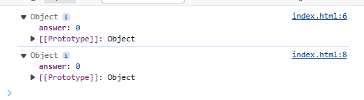

# 開発者ツール (Chrome の場合 F12) のコンソール上に何が表示されるか予想
オブジェクトが2つ表示される。

# 開発者ツールを開いた状態のタブで HTML を開く場合
lifeオブジェクトのanswerが表示される。

# HTML を開いた状態のタブで開発者ツールを開く場合
2つのオブジェクトが表示される。

# 常に期待した結果を得るためにはどのようにコードを修正すべきか
「life」ではオブジェクトが表示されるので「life.answer」にして、表示する値を指定する。
