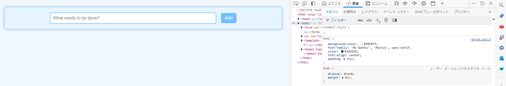

## ToDo アプリに対してブラウザの開発者ツールから値の変更やプロパティの追加を試す

### 15.4-10.1

background-colorを書き換える

もともと  

書き換え後  

### 15.4-10.2

TodoListの文字色を変える  
もともと  
  
書き換え後  

## 開発者ツールで CSS に関して実行できる操作を検索エンジンで調べ、便利だと思ったものを 3 つ

- 開発ツール上でcssをいじった際、どのcssファイルの何行目かを判別できる。  
  

- スペルミスは線が引かれる  
  

- レスポンシブに対応しているかを確認できる  
  

## 15.4-10.2 のアプリの body 要素に対し、元々 HTML および JS 内で利用していなかった Tailwind CSS のクラス (bg-rose-600 など何でも良い) を開発者ツールから追加すると変更が反映されないが、これは何故か

- style.cssの内容で上書きされるから
- ビルドをしてstyle.cssを変える必要がある
