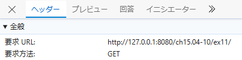
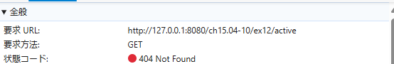

## Active や Completed を選択後にブラウザのリロードを行うとどうなるだろうか

### hashchange

問題なくリロードされる。
いずれも`http://127.0.0.1:8080/ch15.04-10/ex11/`にGETクエストが送られている。  

### pushState

`/acitive`でリロードすると、`http://127.0.0.1:8080/ch15.04-10/ex12/active`にGETリクエストが送られ、エラーが発生する(/completedでも同様の挙動)。  

## サーバー側がどのような挙動をすれば pushState を使った実装が期待通り動作するか

リロードを行う際、`/ex〇〇`に対してGETリクエストを送るようにする。
