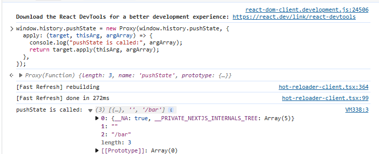
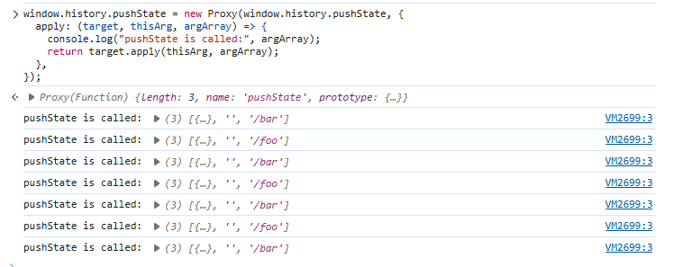

## pushState の呼び出しがログに出力されるようにした状態でリンクを選択するとどうなるだろうか？

以下のようにログには表示される。

## ブラウザの開発者ツールの「ネットワーク」タブを確認してみよう。リンクをクリックしたときに通信は発生しているだろうか？

`http://localhost:3000/bar`でリンクをクリックすると、`localhost:3000/bar?_rsc=〇〇` `localhost:3000/_next/static/chunks/app/foo/page.js`への通信(GETリクエスト)が発生している。  
続けてリンクをクリックすると、`http://localhost:3000/bar?_rsc=〇〇`への通信(GETリクエスト)が発生している。  
以降はリンクをクリックすると、`http://localhost:3000/△△?_rsc=〇〇 (△△はbarもしくはfoo）`
への通信(GETリクエスト)が発生している。

## pushState はいつ実行されているだろうか？

リンクを押下した直後に実行されている  
以下はリンク押下を繰り返した際の画像  

## 15.4-10.12 では pushState を使った実装でページのリロード時に正しく動作しなかったが、この問題ではどうだろうか？

`/foo`でリロードすると`/foo`が、`/bar`でリロードすると`/bar`が正しく表示されており、リロードが正しく動作する。
