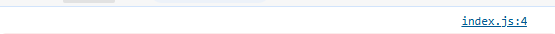
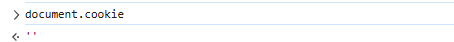
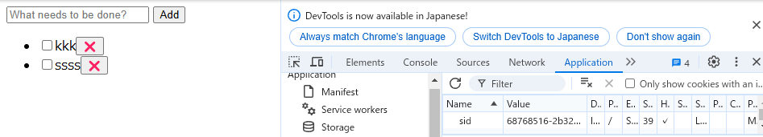
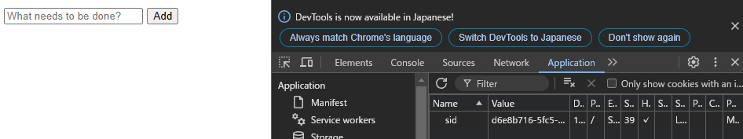

## index.js でdocument.cookie プロパティを console.logで表示する

空が表示された  
HTTPonly指定によりJavaScriptがDocument.cookieプロパティなどを介してクッキーにアクセスすることを禁止するため 
 

## ブラウザの開発者コンソールで http://localhost:3000/ の Cookie を表示する

空が表示された  
理由は上記と同じと思われる 
 

## ToDo アプリのタブをリロードする

タスクは残っており、開発者コンソールのcookieは空だった 
タスクが残っているのは、cookieによるものと思われる。 
aplicationタブでは、sidとvalueのセットでcookieが残っている 
 

## 同一ブラウザの異なるタブやウィンドウで http://localhost:3000/ を開いて ToDo リストの状態を確認する

「ToDo アプリのタブをリロードする」と同じ。   
同一のセッションとみなされているため。 

## シークレットウィンドウや異なるブラウザで http://localhost:3000/ を開いて ToDo リストの状態を確認する

タスクは無く(初期状態)、開発者コンソールのcookieは空だった。 
applicationタブを見ると、これまでとは別のvalueが入っていた。 
別のcookieとなっているため、このような結果になったと思われる。 
 

## http://127.0.0.1:3000/ を開いて ToDo リストの状態を確認する

「シークレットウィンドウや異なるブラウザで http://localhost:3000/ を開いて ToDo リストの状態を確認する」と同じ結果 
