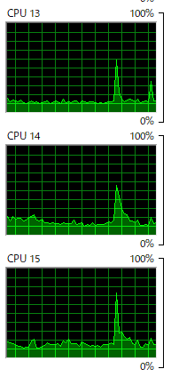

## 用語「マルチスレッド」について調べなさい。

一つのプロセスを複数のスレッド（処理単位）に分け、並行して処理すること  
シングルスレッドでは1つの処理しかできないが、マルチスレッドだと複数同時に処理できる  

## フィボナッチ数を計算するmFib.jsをスレッド数を変更しながら実行し(*1)、 コンソール出力とOS機能(*2)で結果とスレッド数を確認しなさい。

```
node mFib.js 45 1
Total execution time: 17.750s
```

```
node mFib.js 45 4
Total execution time: 8.217s
```

```
node mFib.js 45 7
Total execution time: 7.357s
```

```
node mFib.js 45 15
Total execution time: 7.143s
```

```
node mFib.js 45 16
Total execution time: 7.597s
```

```
node mFib.js 45 17
Total execution time: 7.292s
```

## PCのCPUスペックを調査し、適切なスレッド数についての考察を記しなさい。

AMD Ryzen 7 3700X 8-Core Processor
CPU0～15まで存在している(=16スレッド)。  
公式でも、CPUスレッド数は16と書かれている(https://www.amd.com/en/support/downloads/drivers.html/processors/ryzen/ryzen-3000-series/amd-ryzen-7-3700x.html)。  
  
また、上記に示したスレッド数の確認時では、15スレッド指定の時がもっとも早い。  
そのため、CPUのスレッド数より1つ少ない量が、適切な数と思われる。
