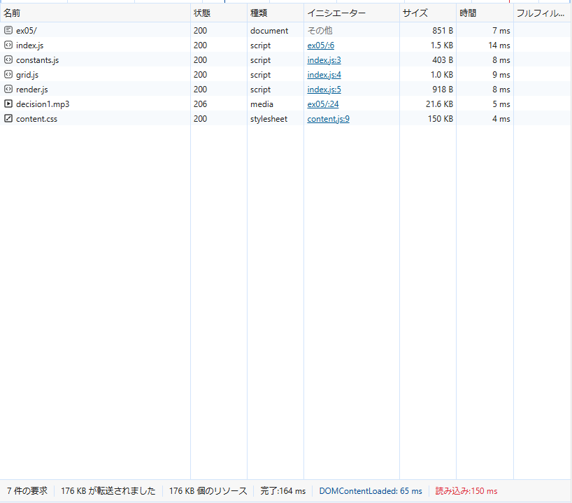
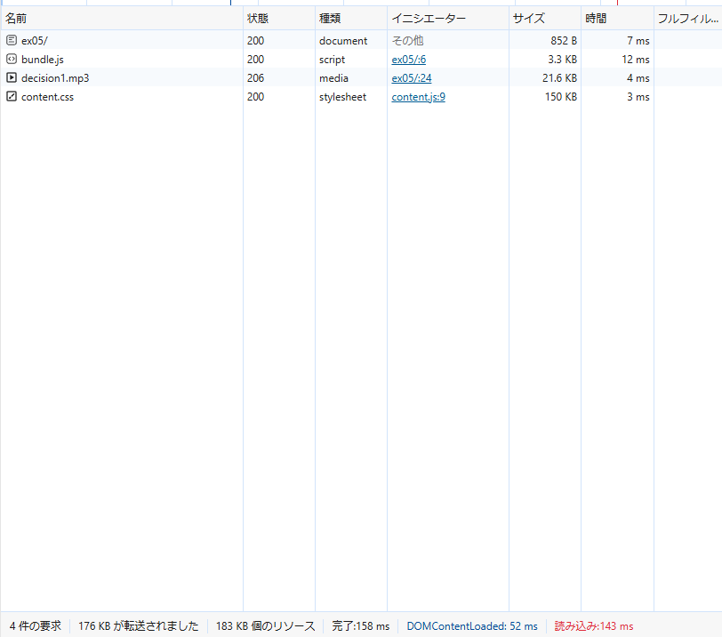

## バンドルしたコードと元のコードを比較し、どのような処理が行われたかを確認しなさい。

- 各ファイルでevalが使われるようになっている

## バンドル前後それぞれのコードを利用するページをローカルサーバで配信してブラウザから閲覧できるようにしなさい。開発者ツールで ネットワーク タブを開き、スクリプトのダウンロード時間、ページの読み込み完了時間について比較しなさい。

スクリプトのダウンロード時間はbundle.jsという1つにまとまっていることもあり、バンドル後のほうが早い。
また、ページ全体の読み込み時間も、バンドル後の方がはやかった。  
バンドル前  

バンドル後  

