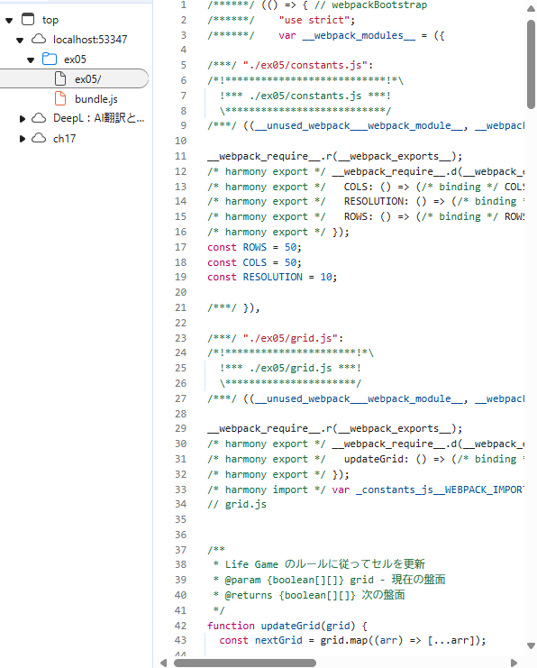
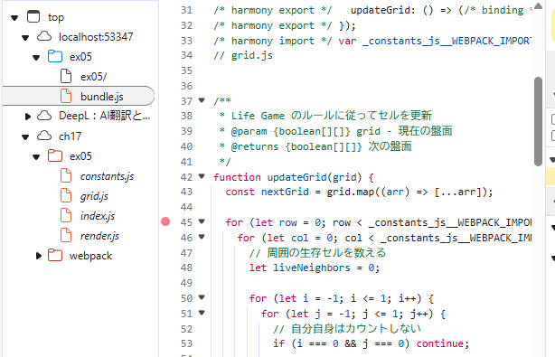
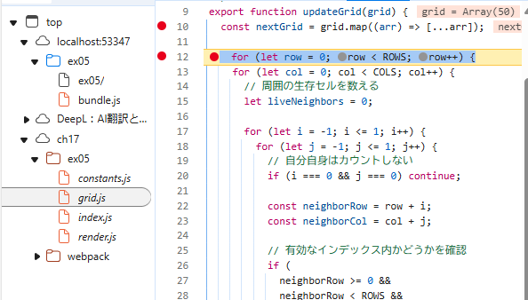
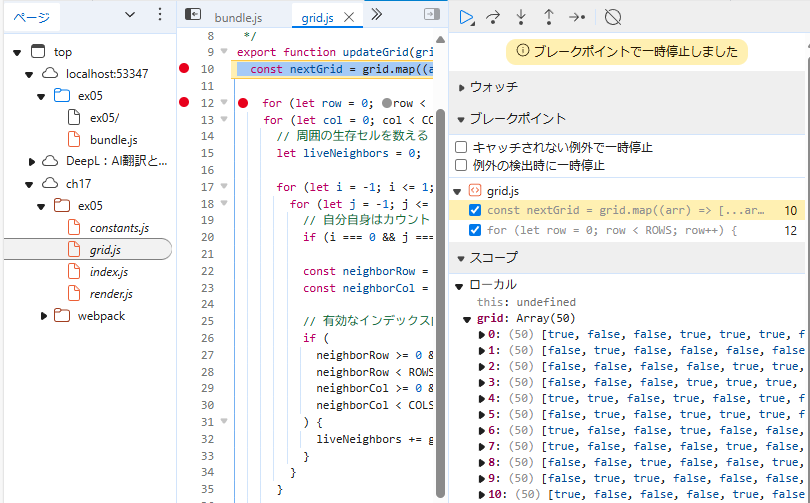

## 開発者ツールで ソース タブ(Chrome, Edge, Safari) または デバッガー タブ(Firefox) を開き、ソースコードファイルがどのように表示されるかを確認しなさい

bundleされたソースコードが表示された

　

## バンドルしたコードの実行中に、バンドル前のソースコードファイルに基づいたブレークポイントの設定や変数の値の確認等のデバッグが可能か確認しなさい

バンドル後の42行目にブレークポイントを設定した。  
　　

その結果、同様の処理を実施している箇所(バンドル前のコード)にブレークポイントが設定された。  
　　

この状態でデバッグ実行すると、変数のデバッグが可能だった  

