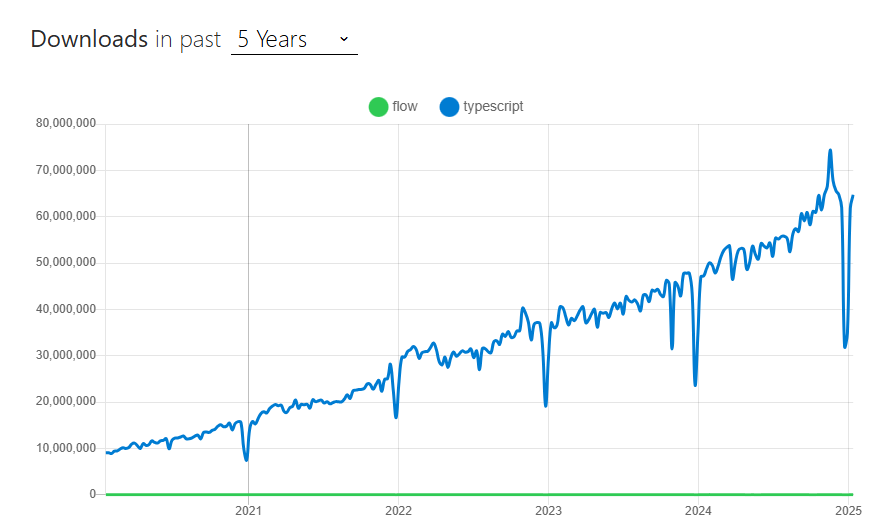

## TypeScriptとFlowについて、どちらが主流となっているかを調べなさい。

TypeScript

## 理由

- 型定義の数がTypeScriptのほうが多い
  - Flowの型定義リポジトリは約850のライブラリの型定義があるが、TypeScriptは約7500のライブラリの型定義がある
- Flowは破壊的変更が多いとされる
- npm trendを見ても、typescriptのほうが圧倒的に利用者が多い  
    
  https://npmtrends.com/Flow-vs-flow-vs-typescript  
  https://zenn.dev/yunika/articles/8313960cfbc979
